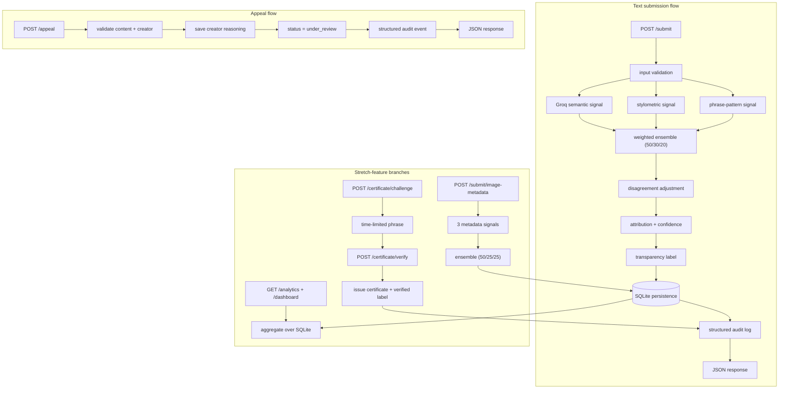

# Provenance Guard

Provenance Guard is a Flask backend and lightweight browser demo for a creative-
writing platform. A creator submits content; the system analyzes several
**independent provenance signals**, returns an attribution with an honest
uncertainty estimate, shows a plain-language transparency label, stores a
structured audit record, and lets the creator appeal or complete a
creator-driven verification process.

> **Detection is not proof.** AI text detection is inherently uncertain, and a
> false accusation against a human writer is far more harmful than a missed AI
> passage. Every result here is framed as an *estimate*, the system is
> deliberately conservative about calling something `likely_ai`, and creators
> can always appeal.

## Project overview

The goal is **not** to prove authorship. It is to offer context, communicate
uncertainty honestly, minimize harmful false positives against human creators,
and provide a fair appeals process. The system combines a Groq LLM semantic
assessment with two transparent, pure-Python signals (stylometric uniformity and
formulaic phrasing), then applies conservative decision gates so a single signal
can never brand a human writer as AI.

## Features

### Required
- `POST /submit` text classification with full per-signal breakdown
- Three independent text signals (Groq semantic, stylometric, phrase-pattern)
- Weighted ensemble with a signal-disagreement confidence penalty
- Conservative attribution gates (`likely_ai` / `likely_human` / `uncertain`)
- Centralized, verbatim transparency labels
- Appeals workflow (`POST /appeal`) with immutable original classification
- Flask-Limiter rate limiting with a JSON `429` handler
- Structured SQLite audit log (`GET /log`), content hashing, safe previews
- Content lookup (`GET /content/<id>`) and health check (`GET /health`)
- Accessible vanilla-JS browser demo

### Stretch
1. **Ensemble detection** — three signal scores exposed individually, `50/30/20`
   weights, disagreement penalty + corroboration gates.
2. **Provenance certificate** — time-limited authorship challenge + draft
   evidence (`POST /certificate/challenge`, `POST /certificate/verify`).
3. **Analytics dashboard** — `GET /analytics` (JSON) and `GET /dashboard` (HTML).
4. **Multimodal** — `POST /submit/image-metadata` with three metadata signals
   (metadata only, never pixels).

## Architecture overview



A submission is validated, then three independent signals each return an
AI-likelihood in `[0, 1]`. A weighted ensemble combines them; a disagreement
penalty lowers confidence when they conflict; conservative gates map the numbers
to an attribution. A centralized function produces the transparency label. The
submission and a structured audit event are written to SQLite in a single
transaction, and the JSON response exposes every individual signal score plus the
ensemble result. Appeals, certificates, analytics, and image-metadata
submissions all reuse this persistence + audit spine.

## API endpoints

| Method & path | Purpose | Success |
| --- | --- | --- |
| `GET /health` | liveness + config | `200` |
| `POST /submit` | classify text | `201` |
| `POST /submit/image-metadata` | classify image metadata | `201` |
| `POST /appeal` | appeal a classification | `201` (or `200` duplicate) |
| `GET /log?limit=50` | audit events, newest first | `200` |
| `GET /content/<id>` | current submission state | `200` |
| `GET /analytics` | aggregate metrics (JSON) | `200` |
| `GET /dashboard` | analytics page (HTML) | `200` |
| `POST /certificate/challenge` | start authorship challenge | `201` |
| `POST /certificate/verify` | complete challenge | `201` |

<details>
<summary>Request / response examples</summary>

**`POST /submit`**
```json
{ "creator_id": "creator-123", "text": "Submitted writing..." }
```
returns
```json
{
  "content_id": "uuid",
  "creator_id": "creator-123",
  "content_type": "text",
  "attribution": "uncertain",
  "ai_likelihood": 0.57,
  "confidence": 0.50,
  "status": "classified",
  "transparency_label": { "variant": "uncertain", "text": "Origin uncertain. ..." },
  "signals": {
    "llm_semantic": { "score": 0.91, "available": true, "reasoning": "...", "indicators": [] },
    "stylometric": { "score": 0.29, "available": true, "metrics": {} },
    "phrase_pattern": { "score": 1.0, "available": true, "matches": [] }
  },
  "signal_disagreement": 0.71,
  "created_at": "2026-07-01T03:27:26.660Z",
  "certificate": null
}
```

**`POST /appeal`**
```json
{ "content_id": "uuid", "creator_id": "creator-123",
  "creator_reasoning": "I wrote this from my own experience and can show drafts." }
```

**`POST /certificate/challenge`** → `{ "challenge_id", "phrase", "expires_at" }`
**`POST /certificate/verify`** → `{ "certificate_id", "status", "certificate_label" }`

</details>

## Detection signals

### Text signals

**1. Groq semantic (`llm_semantic`, weight 0.50).**
- *Measures:* semantic organization, overly balanced exposition, generic
  qualification, formulaic explanation, tone consistency, whether it reads like
  generated prose.
- *Why:* an LLM captures higher-order "feel" the local heuristics cannot.
- *Score:* estimated AI likelihood `0.0–1.0`, parsed from strict JSON and
  clamped. On malformed output or API failure the signal is marked
  `available: false` — never a random score.
- *Misses:* formal human writing, heavily edited AI, short passages, non-native
  English, intentionally casual AI text.

**2. Stylometric uniformity (`stylometric`, weight 0.30).**
- *Measures:* sentence-length variance, coefficient of variation, type-token
  ratio, punctuation density, repeated sentence openings.
- *Why:* generated prose is often unusually uniform; humans vary more.
- *Score:* higher = more uniform = more AI-like. Returns the raw metrics too.
- *Misses:* academic writing, edited professional copy, poetry, deliberately
  repetitive text, very short text.

**3. Formulaic phrase-pattern (`phrase_pattern`, weight 0.20).**
- *Measures:* templates like "It is important to note", "Furthermore", "In
  conclusion", "plays a crucial role", "multifaceted", "delve into".
- *Why:* a cheap, transparent, explainable lexical check.
- *Score:* normalized by length; a single phrase never scores high; multiple
  distinct indicators are required. Returns the matched phrases.
- *Misses:* academic/corporate writing, humans who like formal transitions, AI
  prompted to avoid these phrases.

### Image-metadata signals (metadata only, never pixels)

1. **Generation-tool marker (0.50)** — names known generators (Midjourney,
   DALL-E, Stable Diffusion, Firefly, Flux, ComfyUI, Automatic1111). Editing
   tools like Photoshop are *neutral*, not AI evidence.
2. **Metadata consistency (0.25)** — dimension validity, MIME/extension
   agreement, missing capture metadata. Missing EXIF alone is never proof
   (platforms strip it).
3. **Provenance history (0.25)** — source hash, edit history, creator
   attestation, revision info. More credible process evidence lowers AI
   likelihood; missing evidence only nudges toward uncertainty.

## Confidence scoring

```txt
raw_ai_likelihood   = 0.50*llm + 0.30*stylometric + 0.20*phrase   (text)
                    = 0.50*gen_tool + 0.25*consistency + 0.25*provenance (image)
signal_disagreement = max(scores) - min(scores)
disagreement_penalty= min(0.15, signal_disagreement * 0.20)
base_certainty      = max(raw, 1 - raw)
confidence          = clamp(base_certainty - disagreement_penalty, 0.50, 0.99)
```

- **Conservative gates.** `likely_ai` requires `raw >= 0.80`, `confidence >=
  0.70`, Groq `>= 0.70`, **and** at least one non-LLM signal `>= 0.60`.
  `likely_human` requires `raw <= 0.30`, `confidence >= 0.70`, and at least two
  available signals `<= 0.35`. Everything else is `uncertain`. `likely_ai`
  requires corroboration precisely because a false positive against a human
  writer is the most harmful error.
- **Unavailable signals.** Marked `available: false`; weights re-normalize
  across the available signals; fewer than two available forces `uncertain`
  (text returns `503`). No fake score is ever substituted.
- **Short text (< 40 words).** Forced to `uncertain`, confidence capped at
  `0.60`, with the short-sample suffix added to the label.

### Real example submissions (from `scripts/run_demo.py`, no Groq key set)

These are actual outputs. With no `GROQ_API_KEY`, `llm_semantic` is
`unavailable` and the two local signals carry the ensemble.

**Higher-confidence example — human-like passage → `likely_human`**
> *"My grandmother kept bees behind the shed, and every August the whole yard
> smelled of smoke and clover…"*

| Signal | Score |
| --- | --- |
| llm_semantic | unavailable |
| stylometric | 0.1936 |
| phrase_pattern | 0.0 |

- AI likelihood: **0.1162** · Confidence: **0.8451** · Disagreement: 0.1936
- Attribution: **likely_human**
- Label: *"Likely human-written. The available signals found more human-like
  variation than AI-like patterns. This is an estimate, not a guarantee of
  authorship."*

**Lower-confidence / uncertain example — formulaic passage → `uncertain`**
> *"It is important to note that artificial intelligence plays a crucial role in
> modern society. Furthermore, this multifaceted technology…"*

| Signal | Score |
| --- | --- |
| llm_semantic | unavailable |
| stylometric | 0.286 |
| phrase_pattern | 1.0 |

- AI likelihood: **0.5716** · Confidence: **0.50** · Disagreement: **0.714**
- Attribution: **uncertain**
- Label: *"Origin uncertain. The signals did not agree strongly enough to
  determine whether this content was written by a person or generated with AI."*

This second example is exactly the intended behavior: the phrase signal screams
"AI" (1.0) but the stylometric signal disagrees (0.286), so the large
disagreement (0.714) drives a full `-0.15` confidence penalty and the system
honestly says **uncertain** rather than risk a false accusation. Add a real
`GROQ_API_KEY` (see below) to bring the semantic signal online and reproduce a
corroborated `likely_ai` result.

## Transparency labels

| Result | Exact text displayed |
| --- | --- |
| High-confidence AI | "Likely AI-generated. Multiple independent signals found patterns commonly associated with AI-written text. This result is an estimate, not proof, and the creator may appeal." |
| High-confidence human | "Likely human-written. The available signals found more human-like variation than AI-like patterns. This is an estimate, not a guarantee of authorship." |
| Uncertain | "Origin uncertain. The signals did not agree strongly enough to determine whether this content was written by a person or generated with AI." |

Short-sample suffix (appended when a sample is too short):
> "The submitted sample is too short for a reliable determination."

**Certificate label** (displayed *alongside*, never replacing, the automated label):
> "Verified Human Process. The creator completed a time-limited authorship challenge and supplied draft-process evidence for this submission. This verification is separate from the automated attribution estimate."

## Appeals workflow

- **Request:** `content_id`, `creator_id`, `creator_reasoning` (≥ 20 chars).
- **Ownership check:** `creator_id` must match the submission (else `403`).
  Unknown `content_id` → `404`.
- **Status transition:** a successful appeal creates an appeal record and flips
  status to `under_review`.
- **Immutable classification:** the original attribution/confidence are never
  overwritten; they are preserved in the appeal record and audit event.
- **Duplicate appeals** return the existing appeal (`200`, `duplicate: true`).

Actual appeal response (from the demo):
```json
{
  "appeal_id": "4cb4cf89-06bf-4bac-b945-6243b6322b21",
  "content_id": "0794ddc0-f522-49a6-bb70-5554c8fd1c1f",
  "status": "under_review",
  "creator_reasoning": "I wrote this summary myself from my own research notes and can provide the earlier drafts on request.",
  "submitted_at": "2026-07-01T03:27:26.666Z",
  "message": "Your appeal was received and the content is now under review."
}
```

## Rate limiting

Uses Flask-Limiter with `storage_uri="memory://"`.

| Endpoint | Limit | Reasoning |
| --- | --- | --- |
| `/submit` | `10 per minute;100 per day` | A real writer may test several revisions per session; 10/min allows iterative use while slowing automated flooding and API-cost abuse; 100/day is generous for one creator. |
| `/submit/image-metadata` | `10 per minute;100 per day` | Same iterative-use rationale. |
| `/appeal` | `5 per hour` | Appeals are deliberate, infrequent actions. |
| `/certificate/challenge` + `/verify` | `5 per hour` | Verification is a rare, high-effort action. |

Exceeding a limit returns `429` with:
```json
{ "error": "rate_limit_exceeded", "message": "Too many requests. Please wait before trying again." }
```

Captured evidence from `scripts/rate_limit_demo.py` (the detector is mocked here
**only** so the demo consumes no Groq credits — the limiter configuration is
identical to the real endpoint):
```txt
  request  1: 201 accepted
  ...
  request 10: 201 accepted
  request 11: 429 rate-limited
  request 12: 429 rate-limited

Accepted: 10   Rate-limited: 2
429 JSON body:
{ "error": "rate_limit_exceeded", "message": "Too many requests. Please wait before trying again." }
```

## Audit log

Newest first via `GET /log?limit=50`. Events never store full private text —
only a SHA-256 hash, counts, and a ≤120-char preview. Every event carries
attribution, confidence, and a timestamp. Three real entries from the demo:

| Time (UTC) | Type | Attribution | Confidence | Status |
| --- | --- | --- | --- | --- |
| 2026-07-01T03:27:26.683Z | certificate | likely_human | 0.8451 | verified |
| 2026-07-01T03:27:26.673Z | image_classification | uncertain | 0.67 | classified |
| 2026-07-01T03:27:26.667Z | appeal | likely_human | 0.9402 | under_review |

The **appeal** event sits beside the original classification: it records the
original attribution (`likely_human`) and confidence (`0.9402`) plus the
creator's reasoning in its `details`:
```json
{
  "creator_reasoning": "I wrote this summary myself from my own research notes and can provide the earlier drafts on request.",
  "original_attribution": "likely_human",
  "original_confidence": 0.9402,
  "new_status": "under_review"
}
```

In production this endpoint would require authentication/authorization; it is
open here for demonstration.

## Ensemble detection (stretch feature 1)

Three signals, weights `0.50 / 0.30 / 0.20`. **When the LLM disagrees with the
local signals**, two things protect the creator: (1) the disagreement penalty
subtracts up to `0.15` from confidence, and (2) the corroboration gate means a
high LLM score alone cannot produce `likely_ai` — at least one local signal must
also be `>= 0.60`. The uncertain example above (LLM path offline, phrase 1.0 vs
stylometric 0.29) demonstrates the penalty in action. Tests
`test_strong_ai_agreement_*`, `test_conflicting_signals_*`,
`test_ai_gate_requires_non_llm_corroboration`, and
`test_disagreement_penalty_capped_at_015` cover this.

## Provenance certificate (stretch feature 2)

- **What it verifies:** that the creator completed a *time-limited, creator-
  controlled process* — responded to a fresh challenge phrase, wrote a
  substantive (≥ 50-word) process note, explicitly attested, and supplied ≥ 2
  draft-evidence entries.
- **What it does NOT prove:** it is not mathematical proof of human authorship.
- **Requirements:** creator + content match, unexpired + unused challenge, exact
  phrase present, ≥ 50 words, attestation `true`, ≥ 2 evidence entries.
- **Badge vs label:** the verified badge is visually distinct (green-bordered)
  and appears *alongside* the automated transparency label, which is never
  erased. Issuing a certificate sets status to `verified` **unless** the content
  is already `under_review` (an active appeal is never overwritten).

Actual verification response (from the demo):
```json
{
  "certificate_id": "7a5d060f-816b-4063-b7ff-92f9f0cf3877",
  "content_id": "0ad9b793-c688-474f-b4d7-9209b7a8602f",
  "status": "verified",
  "evidence_summary": "draft-v1-notes.txt; draft-v2-outline.txt",
  "certificate_label": "Verified Human Process. The creator completed a time-limited authorship challenge and supplied draft-process evidence for this submission. This verification is separate from the automated attribution estimate.",
  "issued_at": "2026-07-01T03:27:26.683Z"
}
```

## Analytics dashboard (stretch feature 3)

`GET /analytics` (JSON) and `GET /dashboard` (HTML with CSS bars — no chart
library). Metrics: total / text / image submissions; likely-AI, likely-human,
uncertain counts + ratios; appeal count + rate (unique appealed / total);
average confidence; average signal disagreement; certificate count;
under-review count. Empty databases are handled without division-by-zero.

Actual `/analytics` output from the demo:
```json
{
  "total_submissions": 4,
  "text_submissions": 3,
  "image_metadata_submissions": 1,
  "likely_ai_count": 0, "likely_ai_ratio": 0.0,
  "likely_human_count": 2, "likely_human_ratio": 0.5,
  "uncertain_count": 2, "uncertain_ratio": 0.5,
  "appeal_count": 1, "appeal_rate": 0.25,
  "average_confidence": 0.7388,
  "average_signal_disagreement": 0.3456,
  "certificate_count": 1,
  "under_review_count": 1
}
```

## Multimodal (stretch feature 4)

This pipeline analyzes **structured image metadata, not the visual pixels.** The
three signals (weights `0.50 / 0.25 / 0.25`) are described above. Actual output
for a Midjourney-tagged 1024×1024 PNG with no provenance evidence:

| Signal | Score |
| --- | --- |
| generation_tool | 0.95 |
| metadata_consistency | 0.55 |
| provenance_history | 0.55 |

- AI likelihood: **0.75** · Attribution: **uncertain**

Note the conservatism: even an explicit "Midjourney" marker yields `uncertain`
here because `raw = 0.75 < 0.80` and there is no corroborating inconsistency.
The `likely_ai` gate is reachable when the metadata is also internally
inconsistent or lacks provenance across the board (see
`test_image_scoring_generation_tool_gate`). **Limitations:** social platforms
strip metadata, so a stripped file looks like anything; and a determined creator
can fabricate metadata fields — this is provenance context, not forensic proof.

## Known limitations

- **Formal academic human writing** — uniform syntax and formal transitions
  inflate the stylometric and phrase signals; the corroboration gate and
  disagreement penalty prevent a confident `likely_ai`, but such text often
  lands in `uncertain`.
- **Poetry and deliberate repetition** — low vocabulary diversity and repeated
  openings look "uniform" to the stylometric signal; poems can be mis-scored as
  AI-like, so the system leans to `uncertain` rather than accuse.
- **Non-native English writing** — formal constructions can resemble generated
  prose to both the phrase and LLM signals; again handled by conservative gates,
  not perfectly.
- **Short passages (< 40 words)** — insufficient evidence; forced to
  `uncertain` with confidence capped at `0.60`.
- **Heavily edited AI text** — editing raises stylometric variation and removes
  formulaic phrases, pulling scores toward "human"; this is a genuine false
  negative the system cannot catch.
- **Stripped image metadata** — with no software field, no EXIF, and no
  provenance, the image signals have almost nothing to work with and correctly
  refuse to commit.

## Spec reflection

1. **How planning helped.** Writing the exact ensemble math and the four-part
   `likely_ai` gate in `planning.md` *before* coding meant `scoring.py` was a
   near-direct transcription, and the gate tests were written against fixed
   numbers rather than reverse-engineered from whatever the code happened to do.
2. **A real divergence.** The plan originally described persistence loosely as a
   "structured log." Implementation moved to a **relational SQLite schema** with
   five tables.
3. **Why it diverged.** Appeals (unique-appeal counts), analytics (ratios and
   averages), certificates (single-use challenges), and current-status tracking
   all need queryable relational state that a flat JSON log cannot provide
   cleanly.
4. **The tradeoff.** SQLite adds schema/migration surface and transaction
   handling versus appending to a file, but it buys atomic multi-row writes
   (submission + audit, appeal + status), correct aggregate analytics, and
   enforceable foreign keys — well worth it here.

## AI usage

This project was built with Claude Code as a pair-programmer. Concrete instances:

1. **App skeleton + Groq integration.** I directed Claude Code to generate the
   application factory and the Groq signal from the Architecture and Detection
   sections. It produced a working client call; I **revised** it to add strict
   JSON extraction (`_extract_json`), score clamping, and — most importantly —
   an `available: false` failure path so a Groq outage never becomes a random
   score. I **rejected** an early idea of falling back to `0.5` on error.
2. **Ensemble scoring.** Claude Code initially leaned toward a simpler average
   with near-equal weighting. I **overrode** it with the conservative `50/30/20`
   weights plus the four-condition `likely_ai` corroboration gate and the
   disagreement penalty, because false positives against humans are the costly
   error. I inspected each gate against the unit tests in `test_scoring.py`.
3. **Certificates + transactions.** Claude Code generated the challenge/verify
   flow. I **revised** the transaction boundaries (single-use challenge guard)
   and added the rule that issuing a certificate must **not** erase an active
   appeal (`under_review` is preserved) — verified by
   `test_certificate_does_not_erase_active_appeal`.
4. **Tests.** Claude Code drafted the initial test files; I **added** the
   missing edge cases (disagreement-penalty cap, missing-signal renormalization,
   duplicate-appeal idempotency, expired-challenge via direct DB edit) and fixed
   a hand-miscalculated human-gate fixture.

I made the engineering decisions; Claude Code accelerated the mechanical work and
I reviewed, revised, and overrode its output where it mattered.

## Installation and setup

```bash
# 1. Create and activate a virtual environment
python -m venv .venv

# Windows Git Bash:
source .venv/Scripts/activate
# macOS / Linux:
source .venv/bin/activate
# Windows Command Prompt:
.venv\Scripts\activate.bat

# 2. Install dependencies
pip install -r requirements.txt

# 3. Configure your key (never commit .env)
cp .env.example .env
```

Then edit `.env`:
```txt
GROQ_API_KEY=your_key_here
```

## Running

```bash
python app.py
```
- Demo UI: <http://127.0.0.1:5000/>
- Dashboard: <http://127.0.0.1:5000/dashboard>
- Audit log JSON: <http://127.0.0.1:5000/log>
- Health: <http://127.0.0.1:5000/health>

## Testing

```bash
pytest -q                             # full deterministic suite (no Groq credits used)
python scripts/run_demo.py --reset    # end-to-end demo + writes docs/demo_evidence.json
python scripts/rate_limit_demo.py     # deterministic 10-then-429 demonstration
```

> **Live Groq evidence:** the automated tests and demo run without a key by
> design (the Groq signal reports `available: false`). To produce **live** Groq
> semantic scores, add your real key to `.env` and run:
> ```bash
> python scripts/run_demo.py --reset
> ```
> This is the single command to run after adding your key.

## Security and privacy notes

- API keys are read from the environment and excluded from Git (`.gitignore`);
  `.env` is never committed.
- Audit events store a SHA-256 content hash, counts, and a ≤120-char preview —
  never the full private text.
- `/log` is open for demonstration; in production it would require
  authentication/authorization.
- Rate-limit storage is `memory://` — suitable for local/dev only. Production
  should use a shared store such as Redis.
- The provenance certificate verifies a creator-controlled process; it is
  **not** absolute proof of human authorship.

## Rubric evidence matrix

| Feature | Source file | Endpoint / page | README section | Test file |
| --- | --- | --- | --- | --- |
| Text submission | `provenance_guard/routes.py`, `services.py` | `POST /submit` | API endpoints | `tests/test_submission.py` |
| Groq semantic signal | `provenance_guard/detection/llm_signal.py` | (internal) | Detection signals | `tests/test_detection.py` |
| Stylometric signal | `provenance_guard/detection/stylometric_signal.py` | (internal) | Detection signals | `tests/test_detection.py` |
| Phrase signal | `provenance_guard/detection/phrase_signal.py` | (internal) | Detection signals | `tests/test_detection.py` |
| Ensemble + gates | `provenance_guard/scoring.py` | (internal) | Confidence scoring | `tests/test_scoring.py` |
| Transparency labels | `provenance_guard/labels.py` | all result cards | Transparency labels | `tests/test_submission.py` |
| Appeals | `provenance_guard/appeals.py` | `POST /appeal` | Appeals workflow | `tests/test_appeals.py` |
| Rate limiting | `provenance_guard/extensions.py`, `routes.py` | all POST routes | Rate limiting | `tests/test_rate_limiting.py` |
| Audit log | `provenance_guard/audit.py` | `GET /log` | Audit log | `tests/test_audit_log.py` |
| Content lookup | `provenance_guard/routes.py` | `GET /content/<id>` | API endpoints | `tests/test_submission.py` |
| Health | `provenance_guard/routes.py` | `GET /health` | API endpoints | `tests/test_submission.py` |
| **Bonus 1: ensemble** | `provenance_guard/scoring.py` | `POST /submit` (signals) | Ensemble detection | `tests/test_scoring.py` |
| **Bonus 2: certificate** | `provenance_guard/certificates.py` | `/certificate/*` | Provenance certificate | `tests/test_certificates.py` |
| **Bonus 3: analytics** | `provenance_guard/analytics.py` | `/analytics`, `/dashboard` | Analytics dashboard | `tests/test_analytics.py` |
| **Bonus 4: multimodal** | `provenance_guard/detection/image_metadata_signal.py` | `POST /submit/image-metadata` | Multimodal | `tests/test_multimodal.py` |
