# Provenance Guard — Planning

*Pre-implementation plan. Written before any application code. Updated once more
before stretch features are implemented (see `## Stretch Feature Plan`).*

## Problem statement

AI text detection is not a solved problem, and it never will be with certainty.
The goal of Provenance Guard is **not** to prove authorship. It is to:

- offer *context* about a piece of writing using several independent signals,
- communicate *uncertainty honestly* instead of returning a binary verdict,
- **reduce harmful false positives**, because wrongly accusing a human writer of
  using AI is far more damaging than failing to flag an AI passage, and
- provide a **fair appeals process** and an optional creator-driven
  verification path so people are never stuck with an automated label.

Every result the system returns is framed as an *estimate, not proof*. The word
"detection" is used loosely — what we actually do is measure surface properties
of writing and metadata and report how they line up.

## Architecture

```mermaid
flowchart TD
    subgraph Text["Text submission flow"]
        A[POST /submit] --> B[input validation]
        B --> C[Groq semantic signal]
        B --> D[stylometric signal]
        B --> E[phrase-pattern signal]
        C --> F[weighted ensemble 50/30/20]
        D --> F
        E --> F
        F --> G[disagreement / reliability adjustment]
        G --> H[attribution + confidence]
        H --> I[transparency label]
        I --> J[(SQLite submission record)]
        J --> K[structured audit event]
        K --> L[JSON response]
    end

    subgraph Appeal["Appeal flow"]
        M[POST /appeal] --> N[validate creator + content]
        N --> O[save creator reasoning]
        O --> P[status = under_review]
        P --> Q[structured appeal audit event]
        Q --> R[JSON response]
    end

    subgraph Cert["Certificate flow"]
        S[POST /certificate/challenge] --> T[creator/content validation]
        T --> U[time-limited challenge phrase]
        U --> V[POST /certificate/verify]
        V --> W[validate challenge + process evidence]
        W --> X[issue certificate]
        X --> Y[verified label + audit event]
    end

    subgraph Image["Image-metadata flow"]
        Z[POST /submit/image-metadata] --> AA[metadata validation]
        AA --> AB[generation-tool signal]
        AA --> AC[metadata-consistency signal]
        AA --> AD[provenance-history signal]
        AB --> AE[ensemble 50/25/25]
        AC --> AE
        AD --> AE
        AE --> AF[label]
        AF --> AG[(persistence + audit event)]
    end
```



**Narrative.** A submission arrives at a Flask route and is validated. For text,
three independent signals run: a Groq LLM semantic assessment, a pure-Python
stylometric analysis, and a formulaic-phrase pattern matcher. Each returns an
AI-likelihood score in `[0, 1]`. A weighted ensemble combines them, a
disagreement penalty lowers confidence when signals conflict, and conservative
decision gates convert the numbers into `likely_ai` / `likely_human` /
`uncertain`. A centralized label function turns the attribution into
plain-language transparency text. The submission is persisted to SQLite and a
structured audit event is written in the same transaction. The route returns a
JSON payload that exposes every individual signal score plus the ensemble
result. Appeals, provenance certificates, analytics, and image-metadata
submissions reuse the same persistence + audit spine.

## API contract

| Method & path | Purpose | Key request fields | Key response fields |
| --- | --- | --- | --- |
| `GET /health` | liveness + config check | — | `status`, `database`, `groq_configured` |
| `POST /submit` | classify text | `creator_id`, `text` | full result schema (below) |
| `POST /submit/image-metadata` | classify image metadata | `creator_id`, `metadata{}` | full result schema |
| `POST /appeal` | appeal a classification | `content_id`, `creator_id`, `creator_reasoning` | `appeal_id`, `status`, `message` |
| `GET /log?limit=50` | audit events, newest first | `limit` (query) | `events[]` |
| `GET /content/<content_id>` | current state of a submission | — | submission + appeal + certificate |
| `GET /analytics` | aggregate metrics (JSON) | — | counts, ratios, averages |
| `GET /dashboard` | server-rendered analytics page | — | HTML |
| `POST /certificate/challenge` | start authorship challenge | `content_id`, `creator_id` | `challenge_id`, `phrase`, `expires_at` |
| `POST /certificate/verify` | complete challenge | `challenge_id`, `content_id`, `creator_id`, `challenge_response`, `creator_attestation`, `draft_evidence[]` | `certificate_id`, `status`, label |

### Common result schema (text and image)

```json
{
  "content_id": "uuid",
  "creator_id": "creator-123",
  "content_type": "text | image_metadata",
  "attribution": "likely_ai | likely_human | uncertain",
  "ai_likelihood": 0.87,
  "confidence": 0.82,
  "status": "classified | under_review | verified",
  "transparency_label": { "variant": "...", "text": "..." },
  "signals": { "<name>": { "score": 0.0, "available": true, ... } },
  "signal_disagreement": 0.15,
  "created_at": "ISO-8601 UTC Z",
  "certificate": null
}
```

## Detection signals

All three text signals output an estimated **AI likelihood** in `[0.0, 1.0]`
(higher = more AI-like) so they can be combined directly.

### Signal 1: Groq semantic assessment (`llm_semantic`)

**Output:** AI-likelihood score `0.0`–`1.0`.

**Measures:** semantic organization, overly balanced exposition, generic
qualification, formulaic explanatory language, consistency of tone, and whether
the passage reads like generated prose.

**Blind spots:** formal human writing, heavily edited AI output, short passages,
non-native English writing, intentionally casual AI text.

The Groq prompt requests strict JSON:

```json
{
  "ai_likelihood": 0.0,
  "reasoning": "brief explanation",
  "indicators": ["indicator one", "indicator two"]
}
```

We validate the result, clamp `ai_likelihood` to `0.0–1.0`, and handle malformed
responses and API failures safely by marking the signal `available: false`
rather than inventing a score.

### Signal 2: Stylometric uniformity (`stylometric`)

**Output:** AI-likelihood score `0.0`–`1.0`.

**Measures:** sentence-length variance, coefficient of variation, vocabulary
diversity / type-token ratio, punctuation density, repeated sentence openings,
and variation in sentence complexity. Unusually *uniform* prose is treated as
more AI-like; irregular prose as more human-like.

**Blind spots:** academic writing, edited professional copy, poetry,
deliberately repetitive writing, very short text.

Returns both the score and the calculated metrics. All ratios guard against
division by zero.

### Signal 3: Formulaic phrase-pattern signal (`phrase_pattern`)

**Output:** AI-likelihood score `0.0`–`1.0`.

**Measures:** lexical/rhetorical templates such as "It is important to note",
"Furthermore", "In conclusion", "plays a crucial role", "multifaceted", "delve
into", excessive balanced constructions, repetitive transitions, and generic
opening/conclusion structures.

A single phrase never produces a high score: matches are normalized by length,
contributions are capped, and multiple independent indicators are required for a
high score.

**Blind spots:** academic or corporate writing, human writers who like formal
transitions, AI writing explicitly prompted to avoid common phrases.

Returns the score and the matched patterns.

## Ensemble strategy

Default text weights:

- Groq semantic signal: `0.50`
- Stylometric signal: `0.30`
- Formulaic phrase signal: `0.20`

```txt
raw_ai_likelihood = 0.50*llm + 0.30*stylometric + 0.20*phrase
signal_disagreement = max(scores) - min(scores)
disagreement_penalty = min(0.15, signal_disagreement * 0.20)
base_certainty = max(raw_ai_likelihood, 1 - raw_ai_likelihood)
confidence = clamp(base_certainty - disagreement_penalty, 0.50, 0.99)
```

**Short text (< 40 words):** force `uncertain`, cap confidence at `0.60`, and
state that the sample is too short for a reliable determination.

**Unavailable signals:** record `available: false`; never substitute a fake
score; re-normalize the weights of the available signals only when at least two
signals are available; force `uncertain` if fewer than two signals are
available (route returns `503` for text when this happens).

## Conservative attribution rules

False positives against human creators are worse than false negatives.

Return **`likely_ai`** only when *all* are true:

- `raw_ai_likelihood >= 0.80`
- `confidence >= 0.70`
- Groq score `>= 0.70`
- at least one non-LLM signal `>= 0.60`

Return **`likely_human`** only when:

- `raw_ai_likelihood <= 0.30`
- `confidence >= 0.70`
- at least two available signals `<= 0.35`

Return **`uncertain`** in every other case.

These thresholds are fixed. If test evidence justifies a change, `planning.md`
will be updated and the divergence explained in the README rather than changed
silently.

## Exact transparency-label text

| Variant | Exact label text |
| --- | --- |
| High-confidence AI | "Likely AI-generated. Multiple independent signals found patterns commonly associated with AI-written text. This result is an estimate, not proof, and the creator may appeal." |
| High-confidence human | "Likely human-written. The available signals found more human-like variation than AI-like patterns. This is an estimate, not a guarantee of authorship." |
| Uncertain | "Origin uncertain. The signals did not agree strongly enough to determine whether this content was written by a person or generated with AI." |

Short-sample suffix (appended when needed):

> "The submitted sample is too short for a reliable determination."

Certificate label (stretch feature 2):

> "Verified Human Process. The creator completed a time-limited authorship challenge and supplied draft-process evidence for this submission. This verification is separate from the automated attribution estimate."

## Appeals workflow

- Creator submits `content_id`, `creator_id`, and `creator_reasoning`.
- Reasoning must be meaningful and at least 20 characters.
- The `creator_id` must match the creator stored with the submission.
- A successful appeal creates an appeal record and flips submission status to
  `under_review`.
- The original classification is **never overwritten**.
- The audit event includes the original attribution, original confidence,
  original AI likelihood, appeal reasoning, timestamp, and updated status.
- Duplicate appeals return the existing appeal rather than creating duplicates.
- Unknown content IDs return `404`; creator mismatch returns `403`.

## Anticipated edge cases

1. A formal human research paragraph may score AI-like due to uniform syntax and
   formal transitions — conservative gates and the disagreement penalty guard
   against a false `likely_ai`.
2. A poem with repetition and low vocabulary diversity may wrongly trip the
   stylometric and phrase signals — corroboration gates protect it.
3. A short passage lacks evidence and is forced to `uncertain`.
4. A non-native English writer may use formal constructions resembling generated
   prose — again, corroboration + disagreement penalty reduce false positives.
5. Groq may return malformed JSON or be unavailable — the signal is marked
   unavailable and weights re-normalize; fewer than two signals → `uncertain`.
6. Social platforms strip image metadata, weakening multimodal attribution —
   missing EXIF alone never proves AI.
7. Edited AI text may look more human — acknowledged as a known limitation.
8. A creator may repeatedly submit appeals or certificate requests — duplicate
   appeals are idempotent; challenge/verify endpoints are rate-limited.

## AI Tool Plan

This project is built with Claude Code as a pair-programmer. The plan below maps
the required assignment milestones (M3, M4, M5) to how Claude Code is used and,
crucially, how its output is verified rather than trusted blindly.

### Milestone M3 — Application skeleton, config, and detection signals

- **Planning sections supplied:** Problem statement, Architecture, Detection
  signals, Ensemble strategy.
- **Asked to generate:** the Flask application factory, `config.py`,
  `database.py` schema + connection helpers, and the three text detection
  signal modules with the exact math from the Ensemble section.
- **Verification:** run `pytest tests/test_detection.py` and
  `tests/test_scoring.py`; hand-check the stylometric metrics against a known
  paragraph; confirm the Groq client is never called in tests.
- **Student inspects/revises:** confirm the Groq failure path marks the signal
  unavailable (no random fallback score), and that clamp/normalization math
  matches this plan exactly.

### Milestone M4 — Endpoints, persistence, appeals, rate limiting, audit log

- **Planning sections supplied:** API contract, Conservative attribution rules,
  Appeals workflow, transparency-label table.
- **Asked to generate:** `/submit`, `/appeal`, `/log`, `/content/<id>`,
  `/health` routes; the audit-event writer; Flask-Limiter configuration and the
  JSON `429` handler.
- **Verification:** run `tests/test_submission.py`, `tests/test_appeals.py`,
  `tests/test_rate_limiting.py`, `tests/test_audit_log.py`; verify audit events
  never store full private text (only hash, counts, 120-char preview).
- **Student inspects/revises:** confirm transactions wrap submission+audit and
  appeal+status, that the original classification is immutable, and that the
  label strings are centralized (not duplicated across handlers).

### Milestone M5 — Demo, evidence, README, final verification

- **Planning sections supplied:** the full plan plus real test output.
- **Asked to generate:** `scripts/run_demo.py`, `scripts/rate_limit_demo.py`,
  `README.md`, `WALKTHROUGH.md`, and the rubric evidence matrix.
- **Verification:** run the demo scripts and paste *actual* output into the
  README; confirm all three exact label strings appear verbatim in both
  `planning.md` and `README.md`.
- **Student inspects/revises:** replace any invented numbers with real script
  output; ensure the spec-reflection section honestly records divergences.

### Planned Claude Code use for stretch features

- Generate the ensemble transparency (three visible signal scores) — already
  covered by M3/M4; verify the response exposes each score.
- Generate the certificate challenge/verify flow and its transaction; personally
  review that issuing a certificate does not erase an active appeal.
- Generate the analytics aggregation SQL and the `/dashboard` template; verify
  empty-database handling has no division-by-zero.
- Generate the image-metadata signals and route; verify all three image signals
  are individually visible and that the pipeline is documented as
  metadata-only (no pixel inspection).

*(A detailed `## Stretch Feature Plan` section is appended to this document
after the required features are implemented and before stretch work begins.)*

## Stretch Feature Plan

*This section was added after the required features were implemented and tested,
and before the stretch features were built, as required by the assignment
workflow. All four stretch features are planned below.*

### Stretch feature 1 — Ensemble detection (make it explicit)

The three-signal text ensemble already exists as a required feature, but it is
documented here explicitly as a stretch feature.

- **Plan:** expose all three signal scores individually in the `/submit`
  response and in the demo result card; document the `50/30/20` weights; handle
  conflict via the disagreement penalty and the conservative decision gates.
- **Claude Code use:** already generated in M3/M4. Verify the response exposes
  each score and that `signal_disagreement` is visible, not hidden.
- **Tests:** agreeing signals (`test_strong_ai_agreement_*`), conflicting
  signals (`test_conflicting_signals_*`), penalty cap, and both gates in
  `tests/test_scoring.py`.
- **README:** explain what happens when the LLM disagrees with the local
  signals (disagreement penalty lowers confidence; corroboration gates prevent a
  lone LLM score from producing `likely_ai`).

### Stretch feature 2 — Provenance certificate

A creator-controlled verification process. It does **not** prove human
authorship; it verifies that the creator completed a time-limited challenge and
supplied draft-process evidence.

- **Endpoints:** `POST /certificate/challenge` (creator match, UUID challenge,
  short random phrase, 10-minute expiry) and `POST /certificate/verify` (creator
  + content match, unexpired + unused challenge, exact phrase, ≥50-word
  response, explicit attestation, ≥2 draft-evidence entries).
- **State rules:** on success, issue a certificate UUID and set status to
  `verified` *unless* the submission is already `under_review` (never erase an
  active appeal). Store timestamp + evidence summary; write an audit event.
- **Module:** `provenance_guard/certificates.py`; new tables
  `certificate_challenges` and `certificates`; exact certificate label in
  `labels.py`.
- **Claude Code use:** generate the challenge/verify service and its
  transaction. **Manually verify** the "do not erase an active appeal" rule and
  the single-use challenge guard.
- **Tests:** `tests/test_certificates.py` — creation, mismatch, expiry,
  insufficient response, missing evidence, success, reuse rejection, and the
  appeal-preservation rule.

### Stretch feature 3 — Analytics dashboard

- **Endpoints:** `GET /analytics` (JSON) and `GET /dashboard` (server-rendered
  HTML with CSS bars — no chart library).
- **Metrics:** totals, per-type counts, attribution counts + ratios, appeal
  count + rate (unique appealed submissions / total), average confidence,
  average signal disagreement, certificate count, under-review count.
- **Module:** `provenance_guard/analytics.py`; `templates/dashboard.html`.
- **Claude Code use:** generate the aggregation SQL and template. **Verify**
  empty-database handling has no division-by-zero.
- **Tests:** `tests/test_analytics.py` — empty database, distribution, appeal
  rate, average confidence, certificate count, dashboard render.

### Stretch feature 4 — Multimodal (image metadata)

The second content type is **structured image metadata**, not pixels.

- **Endpoint:** `POST /submit/image-metadata`, returning the same common result
  schema as text.
- **Signals (weights `0.50 / 0.25 / 0.25`):** generation-tool marker,
  metadata-consistency, provenance-history evidence. Editing tools like
  Photoshop must not imply AI; missing EXIF alone is not proof; stronger process
  evidence lowers AI likelihood.
- **Module:** `provenance_guard/detection/image_metadata_signal.py`; reuses the
  persistence + audit spine via `services.classify_image_metadata`.
- **Claude Code use:** generate the three signals and the route. **Verify** all
  three image signals are individually visible and that the pipeline is
  documented as metadata-only.
- **Tests:** `tests/test_multimodal.py` — valid metadata, explicit tool marker,
  stronger provenance, invalid dimensions, individual signals visible, and
  persistence/audit.

### Note on divergence from the original plan

During implementation the persistence layer moved from a conceptual "structured
JSON log" to a relational **SQLite** schema, because appeals, analytics,
certificates, and current statuses all require relational, queryable state
(unique-appeal counts, status transitions, challenge single-use). This
divergence is documented in the README spec-reflection section.
